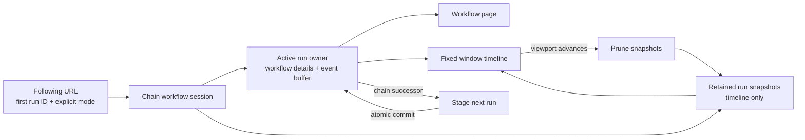

# Continuous Timeline Across Chained Runs

## Status

Ready for implementation after the latest-run compatibility gate in
`Server compatibility gate` passes for the supported server matrix.

This feature makes the workflow timeline follow an execution chain without
changing its canonical route. A chain includes runs created by Continue-As-New,
workflow retry, reset, and cron. The rest of the workflow page displays the
active run, while the timeline retains enough recent runs to draw an
uninterrupted, bounded view. A toggle in the shared workflow header allows the
user to stop or resume following the chain from any workflow tab.

This design builds on the fixed-window timeline described in
`timeline-fixed-window-implementation-plan.md` and the single-owner event model
described in `timeline-architecture.md`.

## Goals

- Keep one stable workflow timeline URL for an execution chain.
- Update workflow details, actions, inputs, results, pending operations, and
  history-derived state to the newest run after any chain transition.
- Preserve visual continuity across the transition.
- End the completed run's workflow rail and begin a new rail labeled with the
  new run ID.
- Allow following to be disabled and resumed from a page-level toggle.
- Keep memory use and timeline work bounded for chains that never terminate.
- Preserve pause, filtering, sorting, idle-time collapsing, event details,
  accessibility, and live-update behavior.

## Non-goals

- Loading or displaying the complete history of an unbounded chain.
- Combining event IDs across runs into a new global event-numbering scheme.
- Changing the existing workflow route hierarchy or introducing a separate
  chain resource route.
- Supporting arbitrary horizontal navigation into pruned history in the first
  release.
- Resolving or jumping from a closed run to the tail of its execution
  chain. A future feature may add this without changing pinned-run semantics.
- Changing the semantics of workflow chaining in the Temporal API.

## User Experience

### URL modes

Bare run URLs are always run-scoped and pinned. They never follow a chain,
including when the selected run is open:

```text
/namespaces/{namespace}/workflows/{workflowId}/{runId}/{tab}
```

Following is an explicit workflow-page mode. Its path uses the first execution
run ID as the chain identity and its query string records that following is on:

```text
/namespaces/{namespace}/workflows/{workflowId}/{firstRunId}/{tab}?follow_continues=on
```

The path does not change when a new run starts or when the user changes workflow
tabs. The first run ID is a canonical identifier only; it does not require the
client to retain or replay every run since the beginning of the chain. The
explicit query parameter makes copied links and reloads deterministic: a bare
URL never acquires following behavior merely because its run belongs to an
execution chain.

The page separates two concepts that are currently represented by the route's
`run` parameter:

- `chainRunId`: the first run ID in the stable URL.
- `activeRunId`: the run whose workflow details and live history the page is
  currently displaying.

### Entering and leaving following mode

The shared workflow header includes a **Follow chained runs** toggle, so the
mode remains visible and controllable on every workflow tab.

Every application-generated link built from an open `WorkflowExecution` enters
following mode. `WorkflowExecution` exposes `firstExecutionRunId`; link producers
inspect `isRunning` or `isPaused` and, when either is true, use that first run ID
in the path and add `follow_continues=on`. This applies to workflow-list Type,
Workflow ID, and Run ID cells; schedule and relationship views; parent and child
workflow links; search results; and other internal links backed by a complete
execution record. The link is canonical when created and does not require an
intermediate navigation through the active run ID.

Links that carry only an explicit workflow ID and run ID, such as event-attribute
execution references, remain bare pinned-run links because they do not know the
target execution's open status or chain identity. Links backed by closed
`WorkflowExecution` records are also bare and pinned. Discovering or jumping
from a closed run to the chain tail is deferred to a future feature.

A bare URL remains an explicit pinned-run URL even when it names an open run.
This preserves a way to type, bookmark, or deliberately copy a pinned link. The
workflow page should offer an explicit **Copy pinned run link** action when
following is on; the ordinary address-bar URL remains the canonical following
link.

When enabled:

- a successor is detected from chain-link history metadata or latest-run
  resolution;
- the page stages the new run;
- workflow details switch to the new run when its initial data is ready; and
- the timeline continues at the same time scale and viewport position.

When the toggle is disabled:

- no further automatic run handoff occurs;
- the page remains pinned to the current `activeRunId`;
- normal polling may continue until that run closes; and
- the URL is replace-navigated to the active run's bare, run-scoped URL.

Turning the toggle on is allowed only while viewing an open run. It validates
the chain identity, canonicalizes the path to the first run ID, adds
`follow_continues=on`, and resolves the newest open run directly. It does not
walk forward through every skipped run.

A closed run never jumps automatically and this release does not offer a
chain-tail lookup or jump action.

The chained-runs toggle is separate from the existing auto-refresh toggle.
Pausing auto-refresh freezes polling and the timeline clock. If the run
transitions while paused, handoff occurs only after auto-refresh resumes and the
chain link is observed or the latest run is resolved.

### Workflow rail

The top workflow lane contains one segment per retained run. A segment:

- begins at the run's `WorkflowExecutionStarted` time;
- ends at its chain-transition boundary or the current live edge;
- uses the run's status styling;
- has boundary dots at its start and end; and
- exposes the full run ID in its accessible name and tooltip.

At a handoff, the completed segment stops animating and receives its terminal
dot. The new segment starts at the new run's start time and becomes the live,
dashed segment. Its label contains the new workflow run ID. Labels may be
shortened visually, but the accessible name and copy action use the full ID.

The two segments use their actual timestamps. They must not overlap or be joined
using an invented duration. A server-observed gap remains a real gap on the
timeline.

## Architecture



### Chain workflow session

A chain session belongs to the shared mounted workflow-run layout, allowing the
active run and following state to remain consistent across every workflow tab.
It is not a global archive and is cleared when the user disables following,
leaves the workflow page, or changes namespace/workflow identity.

```ts
type ChainWorkflowSession = {
  namespace: string;
  workflowId: string;
  firstRunId: string;
  following: boolean;
  generation: number;
  active: ActiveRunState;
  retainedRuns: RetainedTimelineRun[];
  viewport: ChainViewportState;
  truncation: ChainTruncationState | null;
};

type ActiveRunState = {
  runId: string;
  workflowRun: WorkflowRunWithWorkers;
  buffer: GroupedEventBuffer;
  fetch: RunFetchState;
  runtime: RunRuntimeState;
};

type RunFetchState = {
  fetchComplete: boolean;
  latestEventId: number;
  totalExpectedEvents: number;
  descMinId: number;
};

type RunRuntimeState = {
  historyController: AbortController;
  livePollController: AbortController | null;
  pauseHandle: PauseHandle | null;
  lastPollToken: string;
  pollPaused: boolean;
  retryTimer: ReturnType<typeof setTimeout> | null;
  stagingSuccessorRunId?: string;
  dispose: () => void;
};

type RetainedTimelineRun = {
  runId: string;
  status: WorkflowStatus;
  groups: TimelineGroup[];
  startTimeMs: number;
  endTimeMs: number;
  predecessorRunId?: string;
  successorRunId?: string;
  transitionFromPrevious?: ChainTransition;
};

type ChainTransition = 'continue-as-new' | 'retry' | 'reset' | 'cron';

type TimelineGroup = {
  timelineKey: string;
  runId: string;
  group: EventGroup;
};

type ChainViewportState = {
  widthPx: number;
  offsetPx: number;
  expandedDurationPerViewportMs: number;
  overscanViewports: number;
  followingLiveEdge: boolean;
  anchorTimeMs?: number;
  hasMeasuredGeometry: boolean;
};

type ChainTruncationState = {
  beforeTimeMs: number;
  reason: 'run-limit' | 'group-limit' | 'event-limit';
  affectsVisibleInterval: boolean;
};
```

Refactor the grouping core into an instantiable `GroupedEventBuffer`. Existing
consumers may continue to use the current module functions, but those functions
delegate through an `ActiveBufferHandle` rather than closing over one immutable
module singleton. The handle exposes the current instance and one version
signal. Replacing the instance and incrementing that signal occur in the same
synchronous commit function. Staging and backward backfill use bounded temporary
instances that are never installed in the handle before commit.

The workflow layout owns one `ChainWorkflowSession` and publishes its active
state through a run-scoped context. `workflowRun`, `fullEventHistory`, history
fetch progress, and the default buffer API become compatibility views of
`session.active`; they are not independently writable sources of run identity.
Consumers may mutate active-run auxiliary fields only through generation- and
run-guarded session methods.

Each `ActiveRunState` owns every asynchronous resource scoped to that run.
`runtime.dispose()` aborts both controllers, clears the retry timer, and releases
any paused bidirectional-fetch latch by calling its one-shot `resume()` after
abort so the fetch can observe cancellation and exit. It then clears the pause
handle and staged-successor marker and makes subsequent callbacks no-ops. The
workflow layout may own a session-wide refresh interval, but it must call only
generation-guarded active-run methods. A staged successor has a separate runtime
that is disposed if staging is canceled and becomes the active runtime only at
commit.

At handoff, the workflow layout transfers references for the still-relevant
completed groups into a retained snapshot before replacing the active instance.
During backfill, a temporary instance transfers its retained groups to the
session and is then discarded. Events are not cloned: an event is owned by its
assembling buffer and then by its retained snapshot, never by both after
transfer.

Solo events are reduced to run-boundary and chain-link metadata before handoff.
The timeline does not retain full started, terminal, or reset payloads merely to
draw a rail. Retained runs do not keep `WorkflowExecution`, memo, search
attributes, callbacks, pending state, or other non-timeline page data.

Every retained and active timeline group is wrapped in a `TimelineGroup`.
`timelineKey` is namespaced as `{runId}:{group.id}` and is used for focus,
selection, keyed rendering, animation, row-pool state, collapse bookkeeping, and
detail-panel identity. `group.id` and every contained event ID remain unchanged
for display and event lookup. Timeline code must not rewrite `EventGroup.id`.

### Timeline input

`TimelineGraph` should accept a chain-oriented input in addition to the active
workflow:

```ts
type TimelineRun = {
  runId: string;
  status: WorkflowStatus;
  startTimeMs: number;
  endTimeMs: number;
  groups: TimelineGroup[];
};
```

The timeline's overall timespan starts at the earliest retained run and ends at
the active run's end or live clock. Time segments are built from retained and
active groups together. Live state, pending-state enrichment, smooth motion,
and auto-refresh are derived only from the active run.

`WorkflowRow` becomes a run-segment renderer. The graph renders one instance
for each retained run and one for the active run on the same workflow lane.

The existing `full-duration` mode remains run-scoped. Continuous-chain behavior
is enabled only for the main fixed-window timeline.

## Resolving Runs

### Initial load and reload

Following must not reconstruct a chain by starting at `firstRunId` and walking
forward. That operation grows without bound and makes a stable URL unsafe for a
long-lived chain.

Instead:

1. Treat the path run ID as the expected `firstExecutionRunId` for the requested
   chain.
2. Resolve the latest execution for `workflowId` without specifying a run ID.
3. Compare the resolved execution's `firstExecutionRunId` with the path run ID.
   If they differ, reject following and show a chain-identity error with an
   action that removes `follow_continues=on` and opens the path run pinned. Do
   not replace-navigate into the newer chain.
4. Load the validated latest execution as `activeRunId`.
5. Fetch the active run's first ascending history page and its latest descending
   boundary page into the active buffer. Derive the predecessor from the
   `WorkflowExecutionStarted` event's `continuedExecutionRunId` for
   Continue-As-New, retry, and cron, or from reset boundary metadata whose
   `newRunId` matches the active run and whose `baseRunId` identifies the reset
   source. The client must not assume that either field exists on
   `WorkflowExecution`.
6. If the active run does not fill the visible timeline window, fetch that
   predecessor by explicit run ID into a bounded temporary buffer. Validate its
   workflow ID and first execution run ID, then derive its predecessor using the
   same first-page/boundary-page procedure.
7. Continue backward one run at a time. Stop when the visible window plus
   overscan is covered, a link is absent or invalid, an intermediate run is
   deleted or inaccessible, or a hard limit is reached. Do not replace a missing
   predecessor with a list query or an unbounded history scan.

The list and detail workflow responses expose `firstExecutionRunId`, and the UI
`WorkflowExecution` model must preserve it. Following links and the follow
toggle use this field to construct the canonical path. History still validates
the value when staging a successor. The client fetches the first and boundary
history pages when predecessor or successor chain-link metadata is required,
but it does not fetch `WorkflowExecutionStarted` merely to build an initial
link. The first run ID is not used as a traversal starting point.

When `follow_continues=on` is absent, load the path run directly and remain
pinned. A closed path run is never treated as an instruction to find or display
the tail.

### Live handoff

A chain-link event is the preferred handoff signal. The `newExecutionRunId` on
Continue-As-New, failed, timed-out, and completed terminal events identifies the
Continue-As-New, retry, or cron successor. Reset metadata identifies its
`newRunId`; the matching `baseRunId` records the source run. Because resets and
server-version differences may not expose a usable forward link at the active
history boundary, the session also periodically resolves the latest execution
without a run ID while following. A different latest run is accepted only when
its workflow ID and first execution run ID match the session. Workflow status
alone is never treated as proof of a successor.

Handoff uses a staged, generation-guarded transaction:

1. Observe a valid successor ID in chain-link history metadata, or resolve a
   different latest run with the same validated chain identity.
2. Ignore it if following is off, auto-refresh is paused, or a handoff for that
   successor is already in progress.
3. Mark the active workflow rail complete at the chain-transition boundary. Use
   the terminal event time when present; otherwise use the predecessor's
   reported close time or reset boundary time.
4. Fetch the successor's workflow description and enough initial ascending
   history to establish its start and current or terminal boundary into a
   temporary buffer and staging state.
5. Keep rendering the completed current run while staging, avoiding a blank
   timeline or whole-page skeleton flash.
6. Snapshot only current groups that fall inside the retention boundary.
7. Build a complete successor `ActiveRunState`, with empty/default auxiliary
   fields, staged buffer, and staged runtime without mutating published active
   state.
8. In one synchronous `commitActiveRun(...)` call: recheck the expected
   generation and source run ID; dispose the predecessor runtime; transfer the
   retained snapshot; replace `session.active`; replace the active buffer handle;
   clear old-run selection, focus, decoded caches, and auxiliary state; and
   increment the single active-state version. Read-only compatibility stores
   derive from the newly published session rather than being assigned separately.
9. Svelte may render only before or after this commit; no awaited operation or
   reactive publication occurs inside it.
10. Start the successor's bidirectional fetch and live poll.
11. Prune retained data after the new viewport geometry is committed.

Workflow description and boundary-establishing history are the commit readiness
threshold. Workers, metadata, stack/call state, decoded inputs and results, and
other auxiliary data may load after commit. Every such request is tagged with
the session generation and active run ID; stale responses are discarded. Old-run
auxiliary values are cleared at commit so the page never combines successor
identity with predecessor data.

Every asynchronous operation captures the session generation and source run
ID. A response is discarded if the user navigates away, changes the toggle,
or a newer handoff supersedes it. Commit calls the predecessor runtime's
`dispose()` before publishing the successor. Session teardown and canceled
staging dispose their corresponding runtimes through the same API.

### Fast chains

A successor may itself transition again before staging finishes. After each
commit, inspect the staged history for another chain-link event and compare it
with direct-latest resolution. Repeat the handoff until the latest validated
run is reached. Apply a per-cycle hop cap, then yield to the browser before
continuing so a fast chain cannot monopolize the main thread.

If the server can resolve the latest run directly, catch-up should jump to that
run and backfill only the visible window instead of replaying intermediate
handoffs.

### Server compatibility gate

Before behavioral implementation begins, run a compatibility test against every
supported Temporal server version proving that describing a workflow execution
by namespace and workflow ID with no run ID resolves the latest execution. The
test must cover open and fully closed chains created by Continue-As-New, retry,
reset, and cron, plus workflow ID reuse where the latest execution belongs to a
different chain.

If any supported version cannot resolve the latest execution reliably, the
feature requires a bounded ui-server endpoint before client following is
implemented. That endpoint must return the latest execution identity directly;
the client must not substitute an unbounded list query or forward traversal.
Record the supported matrix and chosen resolution path in this document, then
change the status to unconditionally ready.

## Bounded Memory

An infinite chain must have constant client memory with respect to chain age.
The stable first-run URL must not imply stable retention.

### Retention boundary

Retain timeline data only for the visible world interval plus horizontal
overscan on both sides. A practical initial overscan is one additional viewport
behind the visible window. A group crossing the left boundary is retained until
its final visible connector leaves the overscan boundary.

While Timeline is mounted, after each clock tick, resize, collapse change, zoom
change, handoff, or resume:

1. Compute the oldest retained world/time boundary from the viewport and
   overscan.
2. Remove completed groups whose projected end is before that boundary.
3. Remove run records whose end is before the boundary and which own no retained
   groups.
4. Remove their decoded payloads, selection state, focus state, collapse keys,
   and derived scale segments.
5. Rebase world projection state so discarded segments do not remain in scale
   calculations.

`ChainViewportState` is owned by the shared workflow session rather than by the
mounted timeline component. `TimelineGraph` reads and updates it when mounted.
Before unmounting, the graph records whether it was following the live edge and,
if frozen, the time at the viewport anchor. Pixel offset alone is not treated as
stable across an unmounted interval because new runs and collapsed segments can
change the world projection.

While Timeline is unmounted, do not perform viewport-based pruning, advance a
pixel offset, rebuild scale segments, or backfill predecessors. Retain completed
snapshots only up to the configured hard run, group, and event limits. Handoffs
on other workflow tabs therefore stay bounded without recreating a hidden scale
or `TimelineGraph`.

On entering the timeline tab, commit its measured geometry to the session,
rebuild the scale from bounded retained and active data, restore a frozen anchor
by time or follow the current live edge, prune against the resulting boundary,
and backfill predecessors only if the visible window plus overscan is not
covered. Backfill and pruning are generation-guarded.

When pruning rebases the world origin, subtract the discarded world width from
the stored viewport offset in the same synchronous update. The visible time
anchor must remain unchanged unless following the live edge requires it to
advance.

At most one lightweight clipped-boundary marker may remain to communicate that
the visible timeline continues to the left. It must not retain a workflow or
event payload.

### Hard limits

Time-based retention is not sufficient when a workflow produces an extreme
number of runs or events within one viewport. Add configurable hard limits for:

- retained completed runs;
- retained completed groups;
- retained event objects; and
- catch-up/backfill hops per cycle.

When a hard limit is reached, discard the oldest completed data even if it
would otherwise be in overscan. Preserve the active run and prefer groups in
the visible interval over groups that exist only in overscan. Render a clipped
continuation indicator when truncation affects the visible interval and expose
an accessible explanation that older timeline data was omitted for performance.

The active run's current architecture still determines memory use within that
single run. This feature guarantees that memory does not additionally grow with
the number of completed chained runs.

### No hidden growth

Pruning must cover all structures that can retain chain data:

- timeline run and group arrays;
- event detail and decoded-payload caches;
- active/focused group stores;
- collapsed-segment keys;
- scale and viewport segment collections;
- animation bookkeeping;
- retry/dedup sets; and
- closures, subscriptions, and abort controllers from prior runs.

Automated soak tests should assert these collection sizes directly. Browser
heap sampling is useful as a secondary signal but is not the sole correctness
check.

## Page Data Ownership

Only the active run supplies non-timeline page data:

- workflow status and actions;
- workflow details and run ID;
- input and result;
- memo and search attributes;
- callbacks and pending operations;
- workers, metadata, and stack/call state;
- downloads; and
- relationship links.

Core run state switches atomically with `activeRunId`. Auxiliary data cleared at
that boundary may repopulate asynchronously only for the matching generation
and run. Actions must include the active run ID explicitly; they must never fall
back to the first run ID in the path. Download also targets the active run unless
the user has opened an event belonging to a retained run, in which case that
event's run ID is explicit.

Code that currently reads `page.params.run` for an API call must instead read a
run-scoped context supplied by the workflow layout. Route generation continues
to use the canonical first run ID unless creating an explicit pinned-run link.

All workflow route builders accept a shared workflow-mode query object.
`follow_continues=on` is preserved by every workflow tab, filter/sort update,
and in-page link that stays within the same active chain session. It is removed
only when following is disabled or a link intentionally opens a pinned run.
Links from retained event details to their owning historical run are explicitly
pinned and use that event's `runId`. Add `follow_continues` to the shared
query-parameter utilities and audit every workflow-header tab rather than
limiting propagation to Timeline and History.

## Event Details for Retained Runs

Recent completed groups keep their existing event references while retained,
so their detail panels work without a second fetch. Each group carries its
owning run ID for links and API operations.

If a detail panel's group is pruned, move focus to the timeline container and
close the panel, matching existing fixed-window focus behavior. The application
must not keep a pruned group alive solely because its detail panel was open.

Events outside the retained window are not available from the continuous
timeline. Users can open a pinned historical-run route to inspect that run's
complete history.

## Errors and Recovery

- **Successor not visible yet:** keep the completed current run displayed and
  retry with bounded exponential backoff. Show a non-blocking “Waiting for next
  run” state after the first failed attempt.
- **Successor fetch fails:** retain the last good page state, show a retryable
  error, and do not clear the active buffer.
- **Missing or malformed successor run ID:** attempt guarded direct-latest
  resolution once. If it cannot identify a matching successor, stop automatic
  following for this transition and show an error with the source run ID.
- **Run deleted or inaccessible:** keep the available boundary, explain the gap,
  and allow following to jump to the latest resolvable run.
- **Chain identity mismatch:** reject a successor whose workflow ID or reported
  first execution run ID does not match the session.
- **Toggle changed during staging:** abort staging and leave the page pinned to
  the current committed run.

Retries and direct-latest resolution must be cancelable and must not create
parallel live polls.

## Accessibility

- The toggle has an explicit accessible name and exposes its pressed state.
- A successful handoff announces the new run ID and status through a polite
  live region without moving focus.
- Each workflow rail segment has a unique accessible name containing workflow
  ID, run ID, and status.
- Run labels and boundary indicators meet contrast requirements and do not rely
  on color alone.
- Pruning follows the existing timeline rule: focused content is moved to a
  stable timeline element before its row is removed or reused.
- Reduced-motion mode performs the same atomic handoff without animated rail
  movement.

## Telemetry and Diagnostics

Development diagnostics should expose:

- canonical first run ID and active run ID;
- following, paused, and staging states;
- retained run, group, and event counts;
- oldest retention boundary;
- handoff duration and retry count; and
- whether a hard limit caused truncation.

Production telemetry should record aggregate counts and durations, not workflow
IDs or payload data.

## Testing Strategy

### Unit tests

- A bare run URL remains pinned even when the selected run is open.
- Following mode requires `follow_continues=on` and canonicalizes to the first
  run ID.
- Canonical first-run and active-run state remain distinct.
- Chain-link extraction validates terminal `newExecutionRunId` and reset
  `baseRunId`/`newRunId` metadata.
- Backfill obtains predecessor IDs only from bounded first and boundary history
  pages, validates chain identity, and stops at missing or inaccessible links.
- A handoff commits only for the expected session generation and source run.
- Disposing an active or staged run aborts both controllers, releases a paused
  fetch latch, clears timers, and prevents late callbacks from publishing.
- Disabling the toggle cancels staging and pins the committed active run.
- Enabling the toggle resolves latest directly.
- Run-scoped group identities do not collide when event IDs repeat.
- Multiple workflow rail segments project and clip correctly.
- Time-based pruning retains boundary-crossing groups and removes older groups.
- Hard limits prefer visible data, keep the active run, and produce a truncation
  marker.
- Pruning clears selection, focus, collapse, cache, and animation references.

### Component and integration tests

- Every link backed by an open `WorkflowExecution` enters following mode,
  including the Run ID column and links from schedules and relationship views.
- Explicit event-attribute links that carry only workflow and run IDs remain
  pinned even when their target happens to be open.
- A bare URL, including one naming an open run, remains pinned.
- Application-generated following links use `firstExecutionRunId` and are
  canonical when created.
- List and detail response mapping preserves `firstExecutionRunId` in the UI
  `WorkflowExecution` model.
- A following reload rejects a latest execution whose `firstExecutionRunId`
  differs from the chain run ID in the path.
- The canonical following path and query do not change across one or several
  handoffs or workflow-tab changes.
- Following survives navigation through every workflow-header tab and all
  filter and sort query updates.
- Header, details, inputs/results, pending state, actions, and download switch to
  the successor run.
- Continue-As-New, retry, reset, and cron transitions all hand off to their
  validated successors and render the correct transition boundaries.
- The old rail completes and the new labeled rail starts without a blank frame.
- Auto-refresh pause delays handoff; resume catches up.
- Follow-off replace-navigates to the active run's bare URL and survives reload.
- Follow-on catches up without replaying every skipped run.
- A closed run never jumps automatically and offers no chain-tail action.
- Filters, sorting, idle collapse, event details, and keyboard focus work across
  run boundaries.
- A staging failure leaves the current page usable and retry succeeds.
- A deleted intermediate run does not prevent a direct jump to latest.
- A handoff on a non-timeline tab applies hard limits without viewport pruning,
  and entering Timeline restores its anchor, then performs bounded backfill and
  pruning without a hidden timeline component.

### Soak and performance tests

Run workflows that chain thousands of times through Continue-As-New, retry,
reset, and cron, with repeated event IDs.
Assert after periodic garbage collection opportunities that:

- retained collection counts stay at or below configured limits;
- DOM row count stays bounded by the existing row pool;
- timeline scale segment count stays bounded;
- only one live poll and one active workflow fetch exist;
- frame work depends on visible/overscan data, not total chain length; and
- heap use reaches a steady range rather than increasing with completed runs.

Use the existing batched Continue-As-New fixture for browser probes, including a
high-frequency configuration that creates more runs and events than the hard
limits within one viewport. Add retry, reset, and cron fixtures that exercise
their distinct forward- and backward-link metadata.

## Delivery Plan

1. Introduce workflow-wide run-scoped context and separate canonical, active,
   and pinned run IDs without changing behavior. Make active workflow data,
   buffer identity, fetch state, runtime resources, and compatibility stores
   views of one atomically published `ActiveRunState`. Preserve
   `firstExecutionRunId` in the UI `WorkflowExecution` model.
2. Refactor the grouped-event buffer into an instantiable core while preserving
   the current default-instance API for existing consumers.
3. Add explicit following URL semantics, canonical open-workflow link
   generation, pinned bare and explicit-run links, shared query propagation
   across every workflow route, and the shared-header toggle.
4. Implement generation-guarded staging and atomic active-run handoff.
5. Add `TimelineGroup` wrappers, chain timeline inputs, and multi-segment
   workflow rail rendering without changing `EventGroup.id`.
6. Implement bounded backward backfill with temporary buffer instances.
7. Retain recent completed groups and namespace their timeline identities.
8. Move viewport anchors into the shared session; implement hard-limit-only
   retention while Timeline is unmounted, mounted viewport pruning, and cleanup
   of all auxiliary state.
9. Add configurable hard limits, truncation UI, and direct-latest catch-up.
10. Measure representative and high-frequency fixtures, select and document
    the production defaults, then add accessibility announcements, diagnostics,
    integration tests, and soak tests.

Each step must pass:

```bash
pnpm check
pnpm lint
pnpm test -- --run
```

Run targeted integration tests after each behavioral step and the full browser
probe against live Continue-As-New, retry, reset, and cron chains before
completion.

## Remaining Implementation Requirements

- Complete and record the server compatibility gate before behavioral
  implementation begins.
- Keep retained-run, group, event, and per-cycle hop limits configurable. Select
  their production defaults from measurements of representative workflows and
  the high-frequency fixture rather than guessing them in this design.
- When a workflow segment is too narrow for a useful run-ID label, omit the
  visible label. Its boundary control still exposes the full run ID through its
  accessible name, tooltip, and copy action.
